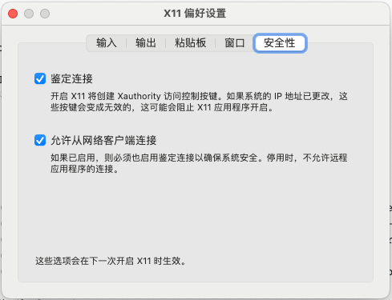

+++
date = '2023-10-11T16:24:38+08:00'
draft = false
title = 'macOS 下使用 X11 运行远程 GUI 应用'
hidesummary = true
+++

> 本文中远程机器为 macOS 下运行的虚拟机

## TLDR

* 在 macOS 上安装 xQuartz
* 设置 xQuartz 允许从网络客户端连接
* 在 macOS 上运行 `host +` 关闭访问控制
* 在远程机器上运行 GUI 应用 DISPLAY=[macOS IP]:[DISPLAY] firefox

## 背景知识

首先需要理解 X Window System 中 Client 和 Server 两个概念，简单来说 Client 为实际运行的程序（比如 Firefox），Client 请求 Server 绘制图像，而 Server 负责在其运行的机器上进行显示。

如果想在远程机器上运行 Firefox 并显示在本地 macOS 系统中，此时远程机器上运行的 Firefox 为 Client，本地 macOS 系统运行的 xQuartz 则为 Server。

> xQuartz 是 X Server 的一个实现，就像 Nginx 为 Web 服务器的一个实现。

Client 主要通过 `DISPLAY` 环境变量指定要连接的 Server，`DISPLAY` 的格式为 `protocol/hostname:displaynumber.screennumber`，这里只需要了解 `hostname` 和 `displaynumber` 即可，详细解释可参考 `man X`。

* protocol: 可选，指定通讯协议，比如 tcp/inet/inet6/unix/local，本文忽略。
* hostname: 可选，指定用于显示的 X Server 的主机名，可以为 IP，本文中为 macOS 的 IP 地址。
* displaynumber: 必选，X Server 会在 6000+displaynumber 端口上监听，Client 和 Server 的 displaynumber 需要对应方可通讯。
* screennumber: 可选，本文不指定该参数，留空默认为 0。

macOS 下可通过 `ps aux | grep Xquartz` 查看 xQuartz 启动时的 displaynumber。

```bash
bash> ps aux | grep Xquartz
guodong          61915   0.0  0.0 34130548    700 s002  S+    9:31上午   0:00.01 grep --color=auto --exclude-dir=.bzr --exclude-dir=CVS --exclude-dir=.git --exclude-dir=.hg --exclude-dir=.svn --exclude-dir=.idea --exclude-dir=.tox Xquartz
guodong          19208   0.0  0.0 34218136   7168   ??  S    10:45下午   0:00.04 /opt/X11/bin/Xquartz :2 -listen tcp +iglx +extension GLX -auth /Users/guodong/.serverauth.19039
guodong          19207   0.0  0.0 34130776    404   ??  S    10:45下午   0:00.01 xinit /opt/X11/etc/X11/xinit/xinitrc -- /opt/X11/bin/Xquartz :2 -listen tcp +iglx +extension GLX -auth /Users/guodong/.serverauth.19039
guodong          19039   0.0  0.0 34131992    500   ??  S    10:44下午   0:00.02 /bin/sh /opt/X11/bin/startx -- /opt/X11/bin/Xquartz
guodong          19038   0.0  0.0 34124008    452   ??  S    10:44下午   0:00.01 /opt/X11/libexec/launchd_startx /opt/X11/bin/startx -- /opt/X11/bin/Xquartz
```

注意上方输出第三行中的 `/opt/X11/bin/Xquartz :2`，这里的 `:2` 表示 xQuartz 监听的 `displaynumber`。

举个例子：假设 macOS 的 IP 为 192.168.1.1，xQuartz 监听的 `displaynumber` 为 2，在远程机器上执行 `DISPLAY=192.168.1.1:2 firefox` 即可在 macOS 上显示 Firefox 窗口。

## 使用 SSH X11 Forwarding

该方法简单无需过多配置，ssh 会在远程机器上打开一个端口进行 X11 转发，并设置 `$DISPLAY` 指向该端口。缺点为效率差，如果远程机器为 macOS 下的虚拟机，打开的 GUI 界面会有明显的延迟卡顿。

这里只简单介绍一下操作步骤，不做过多解释。

操作步骤：
1. 远程机器打开 X11 Forwarding: 编辑 `/etc/ssh/sshd_config` 设置 `X11Forwarding yes`。
2. macOS 安装 xQuartz 然后通过 SSH 连接远程机器 `ssh -Y user@remote`。
3. 通过 SSH 在远程机器中运行 `xeyes`，其界面成功显示在 macOS 中。

## macOS 安装配置 xQuartz

### 安装 xQuartz：
* [xQuartz 官网](https://www.xquartz.org/) 下载 pkg 包手动安装
* `brew install --cask xquartz`

### 设置 xQuartz：



打开 `允许从网络客户端连接` 然后重启 xQuartz。

运行命令 `xhost +` 关闭访问控制，否则远程机器报错 `Authorization required, but no authroization protocol specified`。 需要注意 **xQuartz** 每次启动都会自动开启访问控制。

> 上述设置太过简单粗暴，不推荐在公网环境下使用，可考虑采用更为精确的访问控制，比如 `xhost +[remote_ip]`，具体可参考 `man xhost`

## 远程运行 & 本地显示

首先在 macOS 上查看 xQuartz 监听的 displaynumber。

```bash {linenos=inline}
bash> ps aux | grep Xquartz
guodong          61915   0.0  0.0 34130548    700 s002  S+    9:31上午   0:00.01 grep --color=auto --exclude-dir=.bzr --exclude-dir=CVS --exclude-dir=.git --exclude-dir=.hg --exclude-dir=.svn --exclude-dir=.idea --exclude-dir=.tox Xquartz
guodong          19208   0.0  0.0 34218136   7168   ??  S    10:45下午   0:00.04 /opt/X11/bin/Xquartz :2 -listen tcp +iglx +extension GLX -auth /Users/guodong/.serverauth.19039
guodong          19207   0.0  0.0 34130776    404   ??  S    10:45下午   0:00.01 xinit /opt/X11/etc/X11/xinit/xinitrc -- /opt/X11/bin/Xquartz :2 -listen tcp +iglx +extension GLX -auth /Users/guodong/.serverauth.19039
guodong          19039   0.0  0.0 34131992    500   ??  S    10:44下午   0:00.02 /bin/sh /opt/X11/bin/startx -- /opt/X11/bin/Xquartz
guodong          19038   0.0  0.0 34124008    452   ??  S    10:44下午   0:00.01 /opt/X11/libexec/launchd_startx /opt/X11/bin/startx -- /opt/X11/bin/Xquartz
```

通过第三行输出得知 displaynumber 为 2。

假设 macOS 的 IP 为 192.168.1.1，在远程机器上执行 `DISPLAY=192.168.1.1:2 firefox` 即可在 macOS 上显示 Firefox 窗口。

