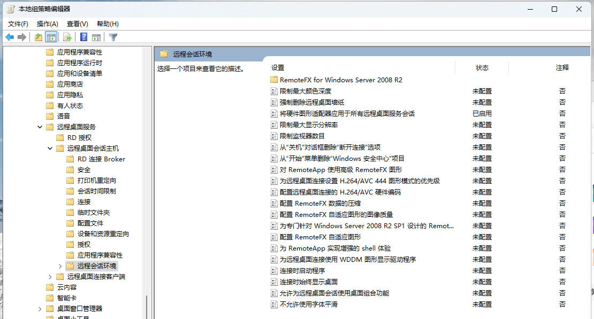
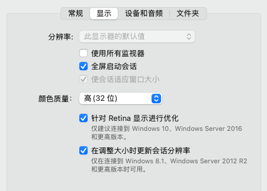

+++
date = '2025-08-27T16:37:38+08:00'
draft = false
title = 'Windows 远程桌面优化'
hidesummary = true
+++

## 解除帧率限制

在注册表 `HKEY_LOCAL_MACHINE\SYSTEM\CurrentControlSet\Control\Terminal Server\WinStations` 中创建名为 `DWMFRAMEINTERVAL` 的 `DWORD` 类型条目。

`DWMFRAMEINTERVAL` 值（十进制）：
* 15（十进制）：60fps
* 8（十进制）：120fps

## 组策略相关参数

`Win+R` 打开 `gpedit.msc`（本地组策略编辑器）。

> 配置项都配有详细的帮助文档，建议仔细阅读

* `计算机配置 > 管理模版 > Windows 组件 > 远程桌面服务 > 远程桌面会话主机`
    * `远程会话环境`
        * `将硬件图形适配器应用于所有远程桌面会话`
        * `为远程桌面连接设置 H.264/AVC 444 图形模式的优先级`
        * `配置远程桌面连接的 H.264/AVC 硬件编码`
        * `配置 RemoteFX 数据的压缩`
        * `配置 RemoteFX 自适应图形的图像质量` \
        如果选择”无损“，带宽占用会飙升，通过播放视频测试，启用前最高 30Mbit/s，启用后 100+Mbit/s。
    * `连接`
        * `选择 RDP 传输协议` \
        局域网中建议启用 `使用 UDP 或 TCP`。

## 远程桌面客户端

MacOS 中使用客户端 Windows App 时，需勾选 `针对 Retina 显示进行优化`，否则画面有轻微模糊。

