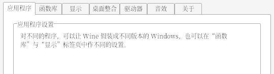

+++
date = '2023-07-01T16:14:43+08:00'
draft = false
title = 'Wine/CrossOver 常见问题'
hidesummary = true
showtoc=true
+++

## 字体发虚



修改注册表项 `[HKEY_CURRENT_USER/Control Panel/Desktop]`，修改完后正常安装其他中文字体即可。

```text
iniFontSmoothing=2 (string key)
FontSmoothingType=0x00000002 (dword key)
FontSmoothingGamma=0x00000578 (dword key)   # 貌似任何值都可以
FontSmoothingOrientation=0x00000001 (dword key) 
```

* FontSmoothing
    * Value “0” or “1”: disables font smoothing
    * Value “2”: enables font smoothing
* FontSmoothingType
    * Value “0” or “1”: switch to gray font smoothing
    * Value “2”: switch to colored font smoothing
* FontSmoothingGamma
    * Value between 0 to 2200 decimal: Intensity of color. 0=dark, 2200=light
* FontSmoothingOrientation
    * Value “0”: CRT (Value “1” and “2” are LCD)
    * Value “1”: RGB format (red, green, blue), normal
    * Value “2”: BGR format (blue, green, red)

参考：
* [Enabling subpixel rendering/anti-aliasing in CrossOver](https://www.codeweavers.com/support/wiki/linux/faq/cxofficeantialias)
* [StackExchange Answer](https://superuser.com/a/945614)

## 修改中文字体

1. 将中文字体放到 `C:\\windows\Fonts\` 目录下。
2. 修改注册表项 `[HKEY_LOCAL_MACHINE\Software\Microsoft\Windows NT\CurrentVersion\FontLink\SystemLink]` - `Tahoma`，将上述中文字体的文件名添加到数据首行。

原理：`Tahoma` 为 Windows 的默认字体，由于其为英文字体，系统在显示字体不支持的字符时会从字体的 Fallback 列表中查找适配字体，
默认 `Tahoma` 的首个 Fallback 为 `SimSun.TFF`（宋体），所以通过修改 `Tahoma` 的 Fallback 即可设置中文字体。
同样直接将 `SimSun.tff` 直接放到 `C:\\windows\Fonts\` 目录下也可以将中文字体设置为宋体。

## 删除 CrossOver 中快捷方式

~macOS 系统下，在 `~/Application/CrossOver/` 中将相应的 `.app` 删除，然后重启 CrossOver。重建程序菜单之后可能会重新出现。~

`~/Library/Application Support/CrossOver/Bottles/<Bottle Name>/cxmenu.conf` 中记录了所有快捷方式，其中包含每个快捷方式所在位置。

通常情况下快捷方式保存在 `c:\\users\crossover\AppData\Roaming\Microsoft\Windows\Start Menu\` 中，删除相应 `.lnk` 文件，然后重建程序菜单即可。