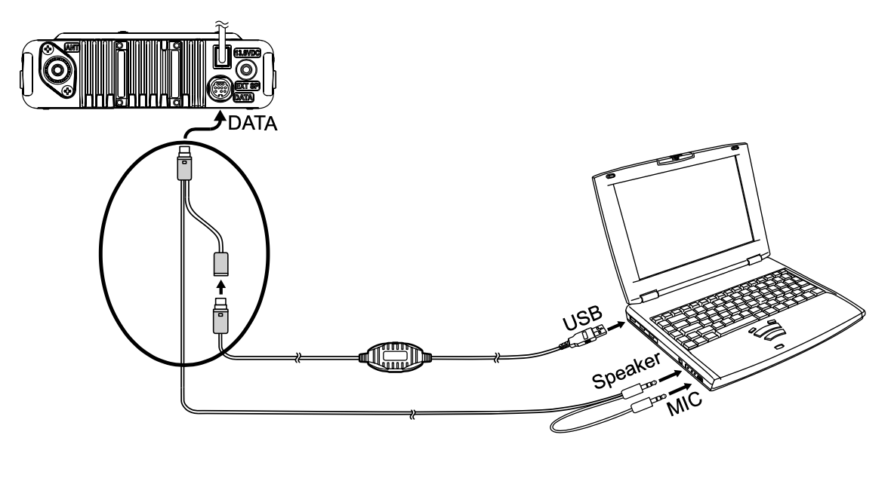

+++
date = '2022-06-14T16:01:34+08:00'
draft = false
title = 'Yaesu SCU-40 套件音频线接线定义'
hidesummary = true
+++

八重洲 FTM-100DR 使用 Wires-X HRI 模式需要 SCU-40 套件连接电台和 PC。可使用 SCU-20 自制 SCU-40 套件。

SCU-40 套件包含一条 SCU-20 以及一条音频线，使用方式如下所示：

**SCU-20** 连接线（随电台附赠）：

**FTM-100DR mini-DIN** 接口定义：



**SCU-40** 音频线接线：
* Speaker 3.5mm 插头的左右声道连接 `pin-1`，为音频输入
* MIC 3.5mm 插头连接 `pin-5`，为音频输出
* 以上两个插头 GND 连接 `pin-2`，接地